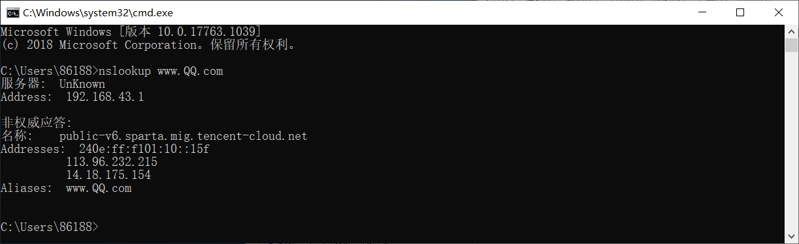
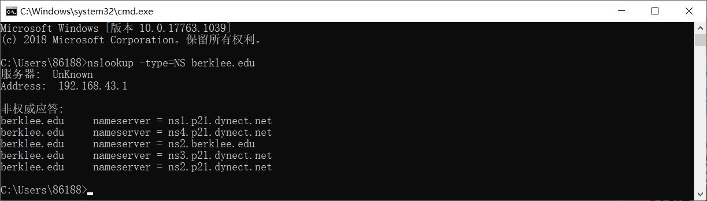
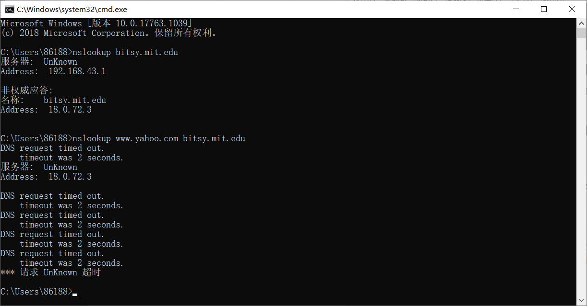

# 我的回答：Wireshark_DNS_v7.0

## 1. nslookup

### 1.Run *nslookup* to obtain the IP address of a Web server in Asia. What is the IP address of that server?

这里以 QQ 为例。

命令行中输入：

```
nslookup www.QQ.com
```

由图可知 www.QQ.com 地址为 **192.168.43.1**



### 2.Run *nslookup* to determine the authoritative DNS servers for a university in Europe.

这里以 <u>berklee.edu</u> 为例。

课文：*If Type=NS , then Name is a domain (such as foo.com ) and Value is the hostname of an authoritative DNS server that knows how to obtain the IP addresses for hosts in the domain.* 

这时，我们输入：

```
nslookup -type=NS berklee.edu
```

可见，<u>berklee.edu</u> 的权威域名服务器分别为：**ns4.p21.dynect.net、 ns2.berklee.edu、ns2.p21.dynect.net、ns1.p21.dynect.net、nameserver = ns3.p21.dynect.net**



### 3.Run nslookup so that one of the DNS servers obtained in Question 2 is queried for the mail servers for Yahoo! mail. What is its IP address?

我看了别人的解答：[实验四利用wireshark分析DNS]( https:/wenku.baidu.com/view/59a0d4fdaef8941ea76e05af.html)。依次输入

```
nslookup bitsy.mit.edu
```

```
nslookup www.yahoo.com bitsy.mit.edu
```

可以做到，不过我按照这篇文章去做时，做不出结果，因为老是超时。就得到了一个 bitsy.mit.edu 的地址。



## 2. ipconfig


