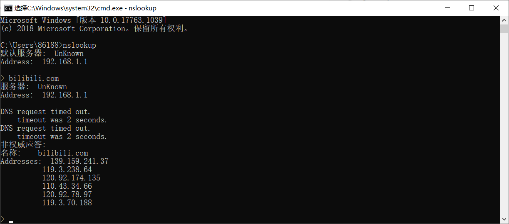

# 2.4.3 DNS Records and Messages：nslookup

## 参考

[应用nslookup命令查看A记录、MX记录、CNAME记录和NS记录](https://blog.csdn.net/qq_38058202/article/details/80468688)

[nslookup查询 - 站长工具](http://tool.chinaz.com/nslookup/)